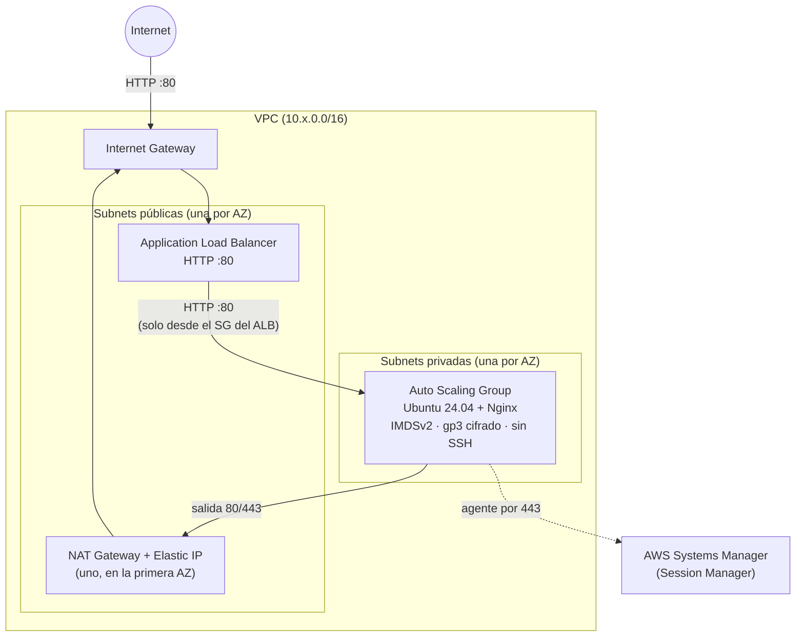
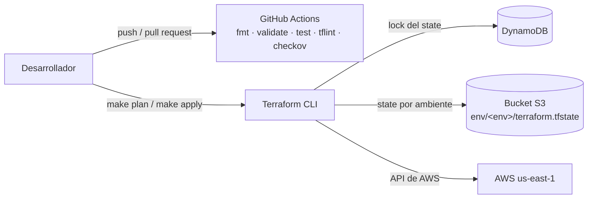

[English](README.md) | **Español**

# iac-terraform

Terraform para una capa web con balanceo de carga en AWS: VPC, Application Load Balancer y un Auto Scaling Group en subnets privadas, desplegados en tres ambientes aislados a partir de los mismos módulos.

[](https://github.com/DiegoTepichin/iac-terraform/actions/workflows/terraform-ci.yml)


[](LICENSE)

## Por qué

Armar infraestructura a mano en la consola de AWS no escala: los ambientes se desalinean, los cambios no se pueden revisar y se cuelan defaults inseguros (SSH abierto, discos sin cifrar, instancias públicas). Este repositorio define todo el stack como código para que:

- **dev, staging y prod salgan de los mismos módulos**; solo cambian las variables de tamaño.
- **Cada cambio se revise antes de llegar a AWS**: formato, validación, lint, tests de módulos y escaneo de seguridad corren en cada push.
- **Las configuraciones inseguras fallen pronto**: las validaciones y precondiciones rechazan valores incorrectos en el `plan`.
- **El state sea compartido y seguro**: state remoto en S3 (versionado, cifrado con KMS) con bloqueo en DynamoDB.

## Arquitectura

Cada ambiente despliega lo siguiente en su propia VPC:



Flujo de state y entrega:



### Qué se crea

| Módulo | Recursos |
|---|---|
| [`modules/networking`](modules/networking) | VPC, Internet Gateway, subnets públicas y privadas (una por AZ), tablas de rutas pública y privada, NAT Gateway con Elastic IP, default security group sin reglas |
| [`modules/web_app`](modules/web_app) | Application Load Balancer, listener HTTP, target group con health checks, launch template, Auto Scaling Group, política de escalado por CPU, security groups del ALB y de las instancias, IAM role e instance profile para SSM |
| [`backend`](backend) | Bucket S3 (versioning, SSE-KMS, lifecycle, acceso público bloqueado) y tabla DynamoDB de locks (point-in-time recovery), ambos con `prevent_destroy` |

Un `terraform plan` crea 31 recursos en dev y staging, y 35 en prod (tres AZs).

### Ambientes

| | dev | staging | prod |
|---|---|---|---|
| CIDR de la VPC | 10.0.0.0/16 | 10.1.0.0/16 | 10.2.0.0/16 |
| Availability zones | 2 | 2 | 3 |
| Tipo de instancia | t3.micro | t3.small | t3.medium |
| ASG mín / deseado / máx | 1 / 1 / 2 | 2 / 2 / 4 | 2 / 3 / 6 |
| Detailed monitoring | no | no | sí |
| Protección contra borrado del ALB | no | no | sí |

## Inicio rápido

Requisitos: Terraform ≥ 1.7, credenciales de AWS (`aws sts get-caller-identity` debe funcionar) y GNU Make.

```bash
make backend-init        # una vez por cuenta de AWS: crea el bucket S3 y la tabla DynamoDB
make backend-config      # genera environments/*/backend.hcl con el nombre del bucket
make init ENV=dev
make plan ENV=dev        # revisa el plan; se guarda en environments/dev/tfplan
make apply ENV=dev       # aplica exactamente ese plan guardado
```

Después abre la URL que imprime `make output ENV=dev` (`app_url`). Cada carga de la página muestra qué instancia y qué availability zone respondió. Para eliminar el ambiente, ejecuta `make destroy ENV=dev`.

> **Costo:** este stack no entra en el free tier. Un NAT Gateway y un load balancer corren todo el tiempo; ver [Costo](#costo). Destruye los ambientes que no estés usando.

Operación de las instancias: no hay SSH. La conexión es con Session Manager:

```bash
aws ssm start-session --target <instance-id>
```

## Tests y checks

Ninguno necesita credenciales de AWS:

```bash
make test           # terraform test con un provider de AWS simulado (13 tests)
make ci             # fmt-check, validate-all, lint, test y security-scan, igual que CI
```

| Check | Herramienta | Qué cubre |
|---|---|---|
| Formato | `terraform fmt -check` | Formato consistente |
| Validación | `terraform validate` | `backend/` y los tres ambientes |
| Tests de módulos | `terraform test` + `mock_provider` | Instancias solo en subnets privadas y accesibles solo desde el ALB, IMDSv2, cifrado, sin llave SSH, health checks del ELB, ruteo por NAT y cada validación de entrada |
| Lint | TFLint (preset recommended + ruleset AWS) | Declaraciones sin usar, tipos de instancia inválidos, documentación y restricciones de versión faltantes |
| Seguridad | Checkov | Configuraciones inseguras de AWS; cada excepción está justificada junto a su recurso |

Los mismos checks corren en [GitHub Actions](.github/workflows/terraform-ci.yml) en cada push y pull request a `main`.

## Variables

Cada ambiente trae valores por defecto (ver la tabla anterior), así que no se necesita archivo `.tfvars`. Para cambiar uno, crea `environments/<env>/terraform.tfvars` (ignorado por git).

| Variable | Tipo | Descripción | Validación |
|---|---|---|---|
| `aws_region` | string | Región de AWS donde se despliega | — |
| `environment` | string | Nombre usado en recursos y tags | `dev`, `staging` o `prod` |
| `vpc_cidr` | string | Bloque CIDR IPv4 de la VPC | CIDR válido |
| `availability_zones` | list(string) | AZs donde se reparten las subnets | al menos 2, una por subnet |
| `public_subnet_cidrs` | list(string) | Subnets públicas (ALB, NAT) | CIDRs válidos |
| `private_subnet_cidrs` | list(string) | Subnets privadas (instancias) | CIDRs válidos |
| `instance_type` | string | Tipo de instancia EC2 | verificado por TFLint |
| `min_size` / `desired_capacity` / `max_size` | number | Capacidad del Auto Scaling Group | `mín ≤ deseado ≤ máx` |
| `enable_detailed_monitoring` | bool | Métricas de CloudWatch cada minuto | — |
| `enable_deletion_protection` | bool | Protege el ALB contra borrado | — |

El módulo `web_app` también expone `cpu_target_percent` (60 por defecto) y `root_volume_size` (8 GiB por defecto).

Outputs: `app_url`, `alb_dns_name`, `autoscaling_group_name`, `vpc_id`.

## Decisiones técnicas clave

- **Instancias en subnets privadas, accesibles solo desde el load balancer.** El security group de las instancias acepta el puerto 80 únicamente desde el security group del ALB, y el ALB solo puede enviar tráfico a ese grupo.
- **Sin SSH.** No hay key pair y el puerto 22 está cerrado. Las instancias tienen un IAM role solo con `AmazonSSMManagedInstanceCore`, así que el acceso es por Session Manager.
- **IMDSv2 obligatorio** con hop limit 1, lo que bloquea el robo de credenciales vía SSRF contra el servicio de metadata.
- **Autorreparable y elástico.** El ASG usa health checks del ELB, así que se reemplaza cualquier instancia cuyo Nginx deje de responder. Una política de target tracking escala según el CPU promedio. Cuando cambia el launch template (nueva AMI, user data o tamaño) corre un instance refresh progresivo.
- **Un directorio por ambiente en lugar de workspaces.** Cada ambiente tiene su propia key de state, y en el comando queda explícito qué ambiente se toca (`ENV=prod`).
- **Configuración parcial del backend.** El nombre del bucket de state vive en un `backend.hcl` ignorado por git que genera `make backend-config`; no está escrito en el repositorio.
- **El backend de state se protege a sí mismo.** El bucket y la tabla de locks tienen `prevent_destroy`, y las versiones viejas del state expiran con una regla de lifecycle (se conservan las últimas 10 durante 90 días) en lugar de acumularse.
- **`plan -out` y luego `apply <plan>`.** `make apply` aplica el plan revisado, no uno recalculado.
- **Trade-offs aceptados**
  - *Un solo NAT Gateway:* uno en la primera AZ ahorra unos $33 al mes por cada AZ adicional. Si esa AZ falla, las instancias de las otras AZs pierden la salida a Internet, pero siguen sirviendo tráfico a través del ALB.
  - *Solo HTTP:* no hay dominio ni certificado de ACM en el alcance, así que el listener es HTTP. Las excepciones de Checkov correspondientes están documentadas en [`alb.tf`](modules/web_app/alb.tf).

## Costo

Costo mensual base en `us-east-1` con la capacidad por defecto (730 horas, precios on-demand de la AWS Price List API). No incluye transferencia de datos, procesamiento de datos del NAT ($0.045/GB), load balancer capacity units ni CloudWatch.

| Componente | dev | staging | prod |
|---|---|---|---|
| Instancias EC2 | $7.59 (1 × t3.micro) | $30.37 (2 × t3.small) | $91.10 (3 × t3.medium) |
| EBS gp3, 8 GiB c/u | $0.64 | $1.28 | $1.92 |
| Application Load Balancer | $16.43 | $16.43 | $16.43 |
| NAT Gateway | $32.85 | $32.85 | $32.85 |
| IPv4 públicas (NAT + una por AZ del ALB) | $10.95 | $10.95 | $14.60 |
| **Total** | **≈ $68** | **≈ $92** | **≈ $157** |

El backend de state (S3 + DynamoDB on-demand) cuesta centavos al mes.

## Estructura del repositorio

```text
.
├── .github/workflows/terraform-ci.yml   CI: fmt, validate, test, tflint, checkov
├── backend/                             bootstrap único del backend de state remoto
├── environments/{dev,staging,prod}/     root modules, un state por ambiente
├── modules/
│   ├── networking/                      VPC, subnets, ruteo, NAT
│   └── web_app/                         ALB, ASG, launch template, IAM, security groups
├── .checkov.yaml  .tflint.hcl  .pre-commit-config.yaml
└── Makefile                             `make help` lista todos los targets
```

## Roadmap

- Listener HTTPS con certificado de ACM y redirección HTTP→HTTPS
- Un NAT Gateway por AZ en prod
- VPC Flow Logs y access logs del ALB
- `plan` en pull requests y `apply` con aprobación desde GitHub Actions vía OIDC (sin llaves de AWS de larga duración)
- Bloqueo nativo del state en S3 (`use_lockfile`, Terraform ≥ 1.10) en lugar de DynamoDB, que las versiones recientes de Terraform marcan como deprecado

## Licencia

[MIT](LICENSE) © 2026 Diego Tepichin
