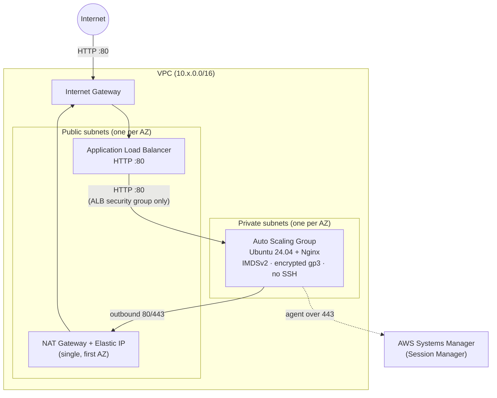
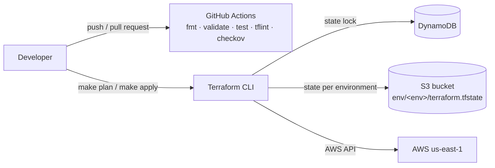

**English** | [Español](README.es.md)

# iac-terraform

Terraform for a load-balanced web tier on AWS: VPC, Application Load Balancer and an Auto Scaling Group in private subnets, deployed to three isolated environments from the same modules.

[](https://github.com/DiegoTepichin/iac-terraform/actions/workflows/terraform-ci.yml)


[](LICENSE)

## Why

Clicking infrastructure together in the AWS console doesn't scale: environments drift apart, changes aren't reviewable, and insecure defaults (open SSH, unencrypted disks, public instances) slip through. This repository defines the whole stack as code so that:

- **dev, staging and prod come from the same modules**; only sizing variables differ.
- **Every change is checked before it reaches AWS**: formatting, validation, linting, module tests and a security scan run on each push.
- **Insecure configurations fail fast**: input validation and preconditions reject bad values at `plan` time.
- **State is shared and safe**: remote state in S3 (versioned, KMS-encrypted) with locking in DynamoDB.

## Architecture

Each environment deploys the following into its own VPC:



State and delivery flow:



### What gets created

| Module | Resources |
|---|---|
| [`modules/networking`](modules/networking) | VPC, Internet Gateway, public and private subnets (one per AZ), public and private route tables, NAT Gateway with Elastic IP, default security group stripped of all rules |
| [`modules/web_app`](modules/web_app) | Application Load Balancer, HTTP listener, target group with health checks, launch template, Auto Scaling Group, CPU target-tracking policy, ALB and instance security groups, IAM role and instance profile for SSM |
| [`backend`](backend) | S3 bucket (versioning, SSE-KMS, lifecycle, public access blocked) and DynamoDB lock table (point-in-time recovery), both with `prevent_destroy` |

A `terraform plan` creates 31 resources in dev and staging and 35 in prod (three AZs).

### Environments

| | dev | staging | prod |
|---|---|---|---|
| VPC CIDR | 10.0.0.0/16 | 10.1.0.0/16 | 10.2.0.0/16 |
| Availability zones | 2 | 2 | 3 |
| Instance type | t3.micro | t3.small | t3.medium |
| ASG min / desired / max | 1 / 1 / 2 | 2 / 2 / 4 | 2 / 3 / 6 |
| Detailed monitoring | off | off | on |
| ALB deletion protection | off | off | on |

## Quickstart

Requirements: Terraform ≥ 1.7, AWS credentials (`aws sts get-caller-identity` should succeed) and GNU Make.

```bash
make backend-init        # one time per AWS account: creates the S3 bucket and DynamoDB table
make backend-config      # writes environments/*/backend.hcl with the bucket name
make init ENV=dev
make plan ENV=dev        # review the plan; it is saved to environments/dev/tfplan
make apply ENV=dev       # applies exactly that saved plan
```

Then open the URL printed by `make output ENV=dev` (`app_url`). Each page load shows which instance and availability zone served the request. To tear the environment down, run `make destroy ENV=dev`.

> **Cost:** this stack is not free-tier. A NAT Gateway and a load balancer run all the time; see [Cost](#cost). Destroy environments you are not using.

Operating the instances: there is no SSH. Connect with Session Manager:

```bash
aws ssm start-session --target <instance-id>
```

## Tests and checks

None of these need AWS credentials:

```bash
make test           # terraform test with a mocked AWS provider (13 tests)
make ci             # fmt-check, validate-all, lint, test and security-scan, same as CI
```

| Check | Tool | What it covers |
|---|---|---|
| Format | `terraform fmt -check` | Consistent formatting |
| Validation | `terraform validate` | `backend/` and the three environments |
| Module tests | `terraform test` + `mock_provider` | Instances only in private subnets and only reachable from the ALB, IMDSv2, encryption, no SSH key, ELB health checks, NAT routing, and every input validation |
| Lint | TFLint (recommended preset + AWS ruleset) | Unused declarations, invalid instance types, missing docs and version constraints |
| Security | Checkov | AWS misconfigurations; every exception is justified inline next to its resource |

The same checks run in [GitHub Actions](.github/workflows/terraform-ci.yml) on every push and pull request to `main`.

## Variables

Every environment ships with defaults (see the table above), so no `.tfvars` file is required. To override one, create `environments/<env>/terraform.tfvars` (git-ignored).

| Variable | Type | Description | Validation |
|---|---|---|---|
| `aws_region` | string | AWS region to deploy into | — |
| `environment` | string | Name used in resource names and tags | `dev`, `staging` or `prod` |
| `vpc_cidr` | string | IPv4 CIDR block of the VPC | valid CIDR |
| `availability_zones` | list(string) | AZs to spread subnets across | at least 2, one per subnet |
| `public_subnet_cidrs` | list(string) | Public subnets (ALB, NAT) | valid CIDRs |
| `private_subnet_cidrs` | list(string) | Private subnets (instances) | valid CIDRs |
| `instance_type` | string | EC2 instance type | checked by TFLint |
| `min_size` / `desired_capacity` / `max_size` | number | Auto Scaling Group capacity | `min ≤ desired ≤ max` |
| `enable_detailed_monitoring` | bool | 1-minute CloudWatch metrics | — |
| `enable_deletion_protection` | bool | Protect the ALB from deletion | — |

The `web_app` module also exposes `cpu_target_percent` (default 60) and `root_volume_size` (default 8 GiB).

Outputs: `app_url`, `alb_dns_name`, `autoscaling_group_name`, `vpc_id`.

## Key technical decisions

- **Instances in private subnets, reachable only from the load balancer.** The instance security group accepts port 80 only from the ALB's security group, and the ALB can only send traffic to that group.
- **No SSH at all.** There is no key pair and port 22 is closed. Instances carry an IAM role with `AmazonSSMManagedInstanceCore` only, so access goes through Session Manager.
- **IMDSv2 required** with hop limit 1, which blocks the SSRF-to-credentials path of the instance metadata service.
- **Self-healing and elastic.** The ASG uses ELB health checks, so an instance whose Nginx stops responding is replaced. A target-tracking policy scales on average CPU. A rolling instance refresh runs whenever the launch template changes (new AMI, user data or size).
- **One directory per environment instead of workspaces.** Each environment has its own state key, and which environment you are touching is explicit on the command line (`ENV=prod`).
- **Partial backend configuration.** The state bucket name lives in a git-ignored `backend.hcl` generated by `make backend-config`, so it is not hard-coded in the repository.
- **The state backend protects itself.** The bucket and lock table have `prevent_destroy`, and old state versions expire through a lifecycle rule (last 10 kept for 90 days) instead of piling up.
- **`plan -out` then `apply <plan>`.** `make apply` applies the reviewed plan, not a freshly computed one.
- **Accepted trade-offs**
  - *Single NAT Gateway:* one NAT in the first AZ saves about $33/month per extra AZ. If that AZ fails, instances in the other AZs lose outbound access but keep serving traffic through the ALB.
  - *HTTP only:* there is no domain or ACM certificate in scope, so the listener is HTTP. The Checkov exceptions for this are documented in [`alb.tf`](modules/web_app/alb.tf).

## Cost

Baseline monthly cost in `us-east-1` at the default capacity (730 hours, on-demand prices from the AWS Price List API). It excludes data transfer, NAT data processing ($0.045/GB), load balancer capacity units and CloudWatch.

| Component | dev | staging | prod |
|---|---|---|---|
| EC2 instances | $7.59 (1 × t3.micro) | $30.37 (2 × t3.small) | $91.10 (3 × t3.medium) |
| EBS gp3, 8 GiB each | $0.64 | $1.28 | $1.92 |
| Application Load Balancer | $16.43 | $16.43 | $16.43 |
| NAT Gateway | $32.85 | $32.85 | $32.85 |
| Public IPv4 (NAT + one per ALB AZ) | $10.95 | $10.95 | $14.60 |
| **Total** | **≈ $68** | **≈ $92** | **≈ $157** |

The state backend (S3 + on-demand DynamoDB) costs cents per month.

## Repository layout

```text
.
├── .github/workflows/terraform-ci.yml   CI: fmt, validate, test, tflint, checkov
├── backend/                             one-time bootstrap of the remote state backend
├── environments/{dev,staging,prod}/     root modules, one state per environment
├── modules/
│   ├── networking/                      VPC, subnets, routing, NAT
│   └── web_app/                         ALB, ASG, launch template, IAM, security groups
├── .checkov.yaml  .tflint.hcl  .pre-commit-config.yaml
└── Makefile                             run `make help` for every target
```

## Roadmap

- HTTPS listener with an ACM certificate and an HTTP→HTTPS redirect
- One NAT Gateway per AZ in prod
- VPC Flow Logs and ALB access logs
- `plan` on pull requests and gated `apply` from GitHub Actions through OIDC (no long-lived AWS keys)
- Native S3 state locking (`use_lockfile`, Terraform ≥ 1.10) to replace DynamoDB, which recent Terraform versions report as deprecated

## License

[MIT](LICENSE) © 2026 Diego Tepichin
