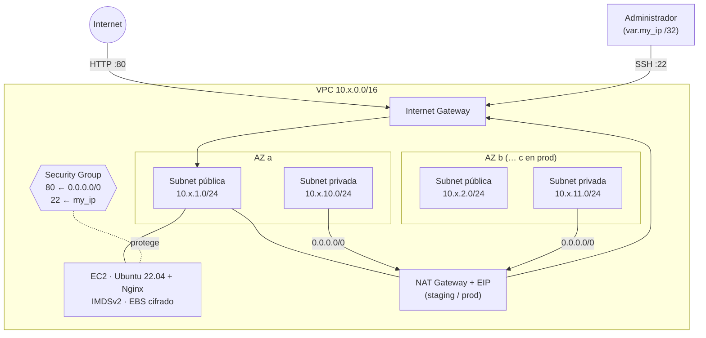
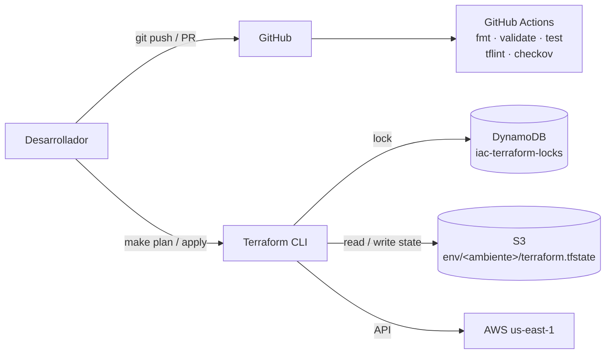

# iac-terraform · Infraestructura AWS multi-ambiente como código

[](https://github.com/DiegoTepichin/iac-terraform/actions/workflows/terraform-ci.yml)


Infraestructura de AWS **modular, reproducible y segura por defecto**, desplegada en tres ambientes aislados (`dev`, `staging`, `prod`) desde una sola base de código, con state remoto bloqueado, validación de entradas, tests automatizados y pipeline de CI con escaneo de seguridad.

---

## Índice

- [El problema que resuelve](#el-problema-que-resuelve)
- [Arquitectura](#arquitectura)
- [Stack y decisiones técnicas](#stack-y-decisiones-técnicas)
- [Estructura del repositorio](#estructura-del-repositorio)
- [Ambientes](#ambientes)
- [Puesta en marcha](#puesta-en-marcha)
- [Calidad y seguridad](#calidad-y-seguridad)
- [Costos y escalabilidad](#costos-y-escalabilidad)
- [Roadmap](#roadmap)

---

## El problema que resuelve

Crear infraestructura a mano desde la consola de AWS no escala: cada ambiente termina siendo distinto, los cambios no son auditables, los errores de seguridad (SSH abierto, discos sin cifrar) pasan desapercibidos y reconstruir un ambiente tras un incidente depende de la memoria de alguien.

Este proyecto convierte esa infraestructura en código versionado:

| Sin IaC | Con este repositorio |
|---|---|
| Ambientes configurados a mano, con deriva entre dev y prod | Los tres ambientes salen de **los mismos módulos**; solo cambian variables |
| Cambios sin revisión | Todo cambio pasa por PR con lint, tests y escaneo de seguridad en CI |
| State local o compartido por correo | **State remoto** en S3 (cifrado, versionado) con **bloqueo** en DynamoDB |
| Errores de seguridad descubiertos en producción | Validaciones que **rechazan** configuraciones inseguras antes del `apply` |
| Recuperación ante desastres manual | Un ambiente completo se recrea con `make plan && make apply` |

---

## Arquitectura

### Vista de red (por ambiente)



### Flujo de state y despliegue



### Árbol de componentes

```text
environments/<env>  (root module, un state por ambiente)
├── provider aws  ── default_tags { Project, Environment, ManagedBy }
├── module "networking"
│   ├── aws_vpc                       (precondición: AZs >= subnets)
│   ├── aws_internet_gateway
│   ├── aws_subnet.public[n]          + route table → IGW
│   ├── aws_subnet.private[n]         + route table → NAT (opcional)
│   ├── aws_eip + aws_nat_gateway     (count = enable_nat_gateway)
│   └── aws_default_security_group    (sin reglas: neutraliza el SG por defecto)
└── module "web_server"
    ├── data.aws_ami                  (Ubuntu 22.04 LTS más reciente, Canonical)
    ├── aws_iam_role + instance profile (AmazonSSMManagedInstanceCore)
    ├── aws_key_pair
    ├── aws_security_group            (HTTP público, SSH solo desde my_ip)
    └── aws_instance                  (IMDSv2, gp3 cifrado, user_data templatizado)

backend/  (bootstrap, state local, se aplica una sola vez)
├── aws_s3_bucket                     (versioning, SSE-KMS, lifecycle, public access block, prevent_destroy)
└── aws_dynamodb_table                (LockID, PAY_PER_REQUEST, PITR, prevent_destroy)
```

---

## Stack y decisiones técnicas

| Tecnología | Uso | Por qué |
|---|---|---|
| **Terraform ≥ 1.5** | Motor de IaC | Declarativo, `plan` revisable antes de aplicar, ecosistema de providers maduro. |
| **AWS provider ~> 5.0** (fijado a 5.100.0 por lock file) | Recursos AWS | Rango compatible para recibir parches; el lock file garantiza builds reproducibles. |
| **S3 + DynamoDB** | Remote state + locking | Estándar de facto en AWS: state durable, cifrado y versionado; el lock evita `apply` concurrentes que corrompan el state. |
| **Módulos locales** | `networking`, `web_server` | Separación por responsabilidad; cada módulo tiene contrato de entrada (variables validadas) y salida (outputs documentados). |
| **Un directorio por ambiente** | `environments/{dev,staging,prod}` | Aislamiento total de state y *blast radius*. Se eligió sobre *workspaces* porque hace explícito en el filesystem qué ambiente se está tocando y permite diferencias reales entre ambientes. |
| **`default_tags` del provider** | Etiquetado | Tags de costo y trazabilidad en todos los recursos sin repetirlos en cada bloque. |
| **`terraform test` + `mock_provider`** | Tests unitarios de módulos | Verifica lógica y validaciones **sin credenciales de AWS y sin costo**. |
| **TFLint** (preset recommended + ruleset AWS) | Linting | Detecta variables sin usar, tipos de instancia inválidos, falta de versionado. |
| **Checkov** | SAST de infraestructura | Política de seguridad como código; cada excepción está justificada junto al recurso. |
| **pre-commit + GitHub Actions** | Shift-left | Los mismos checks corren en la máquina del desarrollador y en cada PR. |

### Decisiones de arquitectura destacadas

- **Seguridad por defecto, no por convención.** `my_ip = "0.0.0.0/0"` no es una advertencia: Terraform lo **rechaza** en la validación. El default security group de la VPC se deja sin reglas para que nada quede expuesto por accidente.
- **Administración sin llaves.** La instancia tiene un IAM role con `AmazonSSMManagedInstanceCore`, lo que habilita Session Manager y Patch Manager y prepara el retiro del puerto 22.
- **IMDSv2 obligatorio** (`http_tokens = "required"`, hop limit 1): mitiga el robo de credenciales del instance profile vía SSRF, el vector del incidente de Capital One (2019).
- **El backend se protege a sí mismo.** Bucket y tabla con `prevent_destroy` y sin `force_destroy`; el lifecycle conserva las últimas 10 versiones previas del state durante 90 días. Perder el state de todos los ambientes no puede ser consecuencia de un comando mal escrito.
- **NAT Gateway único por ambiente.** Un NAT cuesta ~USD 33/mes más transferencia; uno por AZ en prod triplicaría ese costo. Es un trade-off consciente: la caída de la AZ del NAT deja sin salida a Internet a las subnets privadas (no afecta el tráfico entrante al web server). Ver [Roadmap](#roadmap).
- **`plan -out` + `apply <plan>`.** `make apply` aplica exactamente el plan revisado, no uno recalculado.

---

## Estructura del repositorio

```text
iac-terraform/
├── .github/workflows/terraform-ci.yml   # CI: fmt, validate, test, tflint, checkov
├── backend/                             # Bootstrap del remote state (S3 + DynamoDB)
├── environments/
│   ├── dev/                             # Root module dev
│   ├── staging/                         # Root module staging
│   └── prod/                            # Root module prod
├── modules/
│   ├── networking/                      # VPC, subnets, IGW, NAT, routing
│   │   └── tests/                       # terraform test
│   └── web_server/                      # EC2, SG, key pair, user_data
│       ├── templates/user_data.sh.tftpl
│       └── tests/
├── .checkov.yaml                        # Política de Checkov
├── .tflint.hcl                          # Reglas de TFLint
├── .pre-commit-config.yaml              # Hooks locales
├── Makefile                             # Interfaz única de operación (make help)
└── CONTRIBUTING.md                      # Convenciones y flujo de trabajo
```

---

## Ambientes

| Ambiente | Instancia | Detailed monitoring | NAT | AZs | VPC CIDR |
|---|---|---|---|---|---|
| `dev` | t3.micro | No | No | 2 | 10.0.0.0/16 |
| `staging` | t3.small | No | Sí | 2 | 10.1.0.0/16 |
| `prod` | t3.medium | Sí | Sí | 3 | 10.2.0.0/16 |

Los rangos CIDR no se solapan, lo que permite conectar los ambientes por VPC peering o Transit Gateway en el futuro sin re-direccionar.

---

## Puesta en marcha

### Prerrequisitos

| Herramienta | Versión | Uso |
|---|---|---|
| [Terraform](https://developer.hashicorp.com/terraform/install) | ≥ 1.5 (≥ 1.7 para `make test`) | Obligatorio |
| [AWS CLI](https://aws.amazon.com/cli/) | v2 | Credenciales (`aws configure` o `AWS_PROFILE`) |
| Llave SSH | — | Pública en `~/.ssh/id_rsa.pub` (configurable) |
| [TFLint](https://github.com/terraform-linters/tflint), [Checkov](https://www.checkov.io/), [pre-commit](https://pre-commit.com/) | recientes | Opcionales, para desarrollo |

### 1. Credenciales

Terraform usa la cadena estándar de credenciales de AWS. No hay llaves en el código.

```bash
export AWS_PROFILE=mi-perfil        # o AWS_ACCESS_KEY_ID / AWS_SECRET_ACCESS_KEY
aws sts get-caller-identity         # verifica la identidad antes de continuar
```

### 2. Bootstrap del backend (una sola vez por cuenta)

```bash
make backend-init
# Output: state_bucket = "iac-terraform-state-xxxxxxxx"
```

Copia el nombre del bucket en `environments/<env>/backend.tf` (campo `bucket`). El state de `backend/` es local y **no** se versiona: guárdalo en un lugar seguro.

### 3. Variables del ambiente

```bash
cp environments/dev/terraform.tfvars.example environments/dev/terraform.tfvars
echo "my_ip = \"$(curl -s ifconfig.me)/32\""   # pega este valor en terraform.tfvars
```

| Variable | Requerida | Default (dev) | Descripción |
|---|---|---|---|
| `my_ip` | **Sí** | — | CIDR autorizado para SSH. `0.0.0.0/0` es rechazado. |
| `aws_region` | No | `us-east-1` | Región de despliegue |
| `instance_type` | No | `t3.micro` | Tipo de instancia EC2 |
| `public_key_path` | No | `~/.ssh/id_rsa.pub` | Llave pública SSH |
| `enable_nat_gateway` | No | `false` | NAT para subnets privadas |
| `enable_detailed_monitoring` | No | `false` | Métricas de CloudWatch cada 1 min |
| `vpc_cidr`, `*_subnet_cidrs`, `availability_zones` | No | ver `variables.tf` | Direccionamiento de red |

### 4. Desplegar

```bash
make init   ENV=dev
make plan   ENV=dev     # revisa el plan guardado
make apply  ENV=dev     # aplica exactamente ese plan
make output ENV=dev     # IP / DNS públicos
curl "http://$(terraform -chdir=environments/dev output -raw dev_instance_public_ip)"
```

### 5. Promoción a staging / prod

El flujo es idéntico cambiando `ENV`. En un contexto de equipo, `staging` y `prod` deben aplicarse desde CI con aprobación manual (ver [Roadmap](#roadmap)), nunca desde una laptop.

### 6. Destruir

```bash
make destroy ENV=dev
```

El backend está protegido con `prevent_destroy`. Para eliminarlo hay que retirar explícitamente esa protección en `backend/main.tf`, vaciar el bucket y ejecutar `make backend-destroy`.

Ejecuta `make help` para ver todos los comandos.

---

## Calidad y seguridad

Estado actual de los checks (ejecutables localmente con `make ci`):

| Check | Herramienta | Resultado |
|---|---|---|
| Formato | `terraform fmt -check` | ✅ sin diferencias |
| Validación (4 root modules) | `terraform validate` | ✅ válidos |
| Tests de módulos | `terraform test` | ✅ 11/11 |
| Lint | TFLint + ruleset AWS | ✅ 0 issues |
| Seguridad | Checkov 3.3 (incluye checks de grafo `CKV2_*`) | ✅ 58 pasados · 0 fallidos · excepciones justificadas |

**Controles aplicados**

- State cifrado (SSE-KMS con bucket key), versionado, con lifecycle y acceso público bloqueado; lock en DynamoDB con PITR.
- SSH restringido a una IP (validado); HTTP es el único puerto público.
- IMDSv2 obligatorio; volumen raíz gp3 cifrado; IAM role de mínimo privilegio para SSM.
- Default security group de la VPC sin reglas.
- `*.tfstate` y `*.tfvars` excluidos de git; hook `detect-private-key` en pre-commit.
- Lock files versionados para builds reproducibles.

**Excepciones de Checkov documentadas** (inline, junto al recurso):

| Check | Motivo |
|---|---|
| `CKV_AWS_130` | Las subnets públicas asignan IP pública por diseño. |
| `CKV_AWS_260` | Web server público: HTTP desde Internet es su función. |
| `CKV_AWS_382` | Egress abierto requerido para `apt` (parches de seguridad). |
| `CKV_AWS_24` | Falso positivo: SSH se limita a `var.my_ip`, que no admite `0.0.0.0/0`. |
| `CKV_AWS_119` | La tabla de locks no guarda datos sensibles; la llave administrada por AWS es suficiente. |
| `CKV_AWS_126` | Detailed monitoring tiene costo; se activa por variable (activo en prod). |
| `CKV2_AWS_19` | Falso positivo: la EIP pertenece al NAT Gateway, no a una instancia. |
| `CKV2_AWS_11` | VPC Flow Logs pendientes por costo; están en el roadmap. |
| `CKV_AWS_18` · `CKV_AWS_144` · `CKV2_AWS_62` | Access logging, replicación cross-region y notificaciones del bucket de state: sobredimensionados para este alcance; el versioning y CloudTrail cubren recuperación y auditoría. |

---

## Costos y escalabilidad

Costo mensual **estimado** en `us-east-1`, on-demand, 730 h/mes, sin transferencia de datos ni almacenamiento:

| Componente | dev | staging | prod |
|---|---|---|---|
| EC2 | t3.micro ≈ $7.6 | t3.small ≈ $15.2 | t3.medium ≈ $30.4 |
| NAT Gateway | — | ≈ $32.9 | ≈ $32.9 |
| IPv4 públicas (instancia + EIP del NAT) | ≈ $3.7 | ≈ $7.3 | ≈ $7.3 |
| Detailed monitoring | — | — | ≈ $2.1 |
| **Total aproximado** | **≈ $11** | **≈ $55** | **≈ $73** |

El backend (S3 + DynamoDB on-demand) cuesta centavos al mes con este volumen. `dev` desactiva el NAT, el mayor costo fijo del diseño.

**Escalabilidad**

- Agregar un ambiente = copiar un directorio de `environments/` y ajustar `variables.tf`; los módulos no cambian.
- Agregar una AZ = añadir un elemento a `availability_zones` y a las listas de subnets; la precondición del módulo impide configuraciones inconsistentes.
- Los módulos son reutilizables desde cualquier root module (o publicables en un registry privado con versionado semántico).

---

## Roadmap

Próximos pasos para llevar este diseño a una carga productiva real:

- [ ] Mover la instancia a subnets privadas detrás de un **Application Load Balancer** con HTTPS (ACM) y un **Auto Scaling Group** multi-AZ.
- [ ] Retirar el puerto 22 y operar solo con **Session Manager** (el IAM role ya está en su lugar).
- [ ] **NAT Gateway por AZ** en prod.
- [ ] **VPC Flow Logs** hacia CloudWatch Logs o S3.
- [ ] Workflow de `plan` en PR y `apply` con aprobación manual vía **GitHub OIDC** (sin llaves de AWS de larga duración).
- [ ] Migrar el locking de DynamoDB a `use_lockfile` nativo de S3 (Terraform ≥ 1.10).

---

## Autor

**Diego Durón Tepichín** · [GitHub](https://github.com/DiegoTepichin)

Convenciones y flujo de trabajo del proyecto: [CONTRIBUTING.md](CONTRIBUTING.md).
